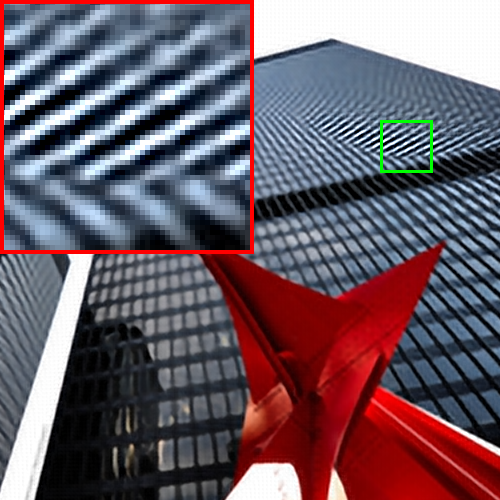
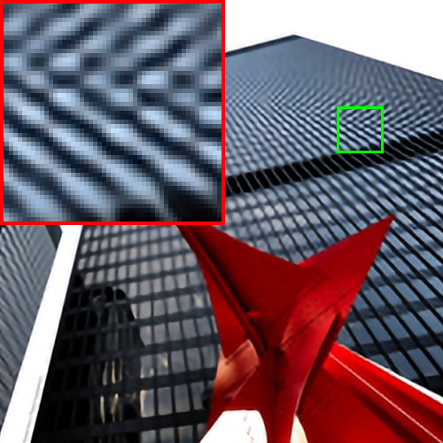
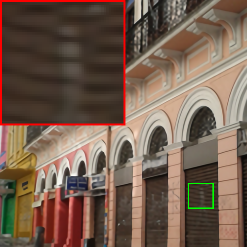
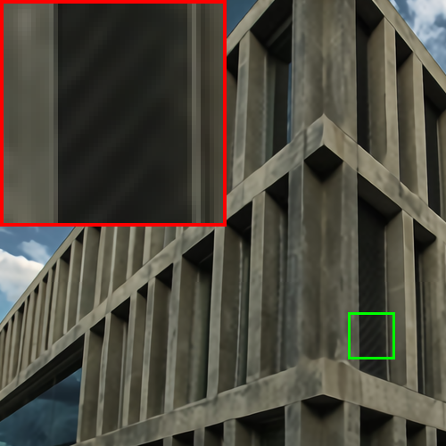

# DualConv

### Codes for paper "Dual Convolution Re-parameterization for Image Super-resolution".

|Models    | HR        | w/o DCB  | w/ DCB |
|:---------|:---------:|:--------:|:------:|
|FSRCNN     | |||
|EDSR-baseline | |||
|RCAN      | |||
